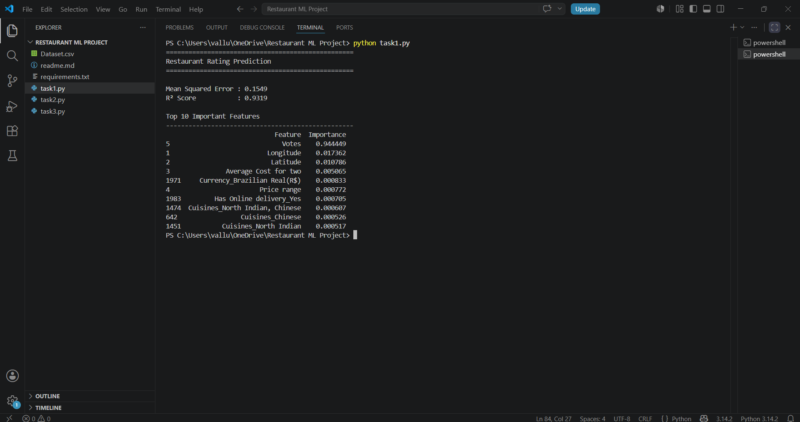
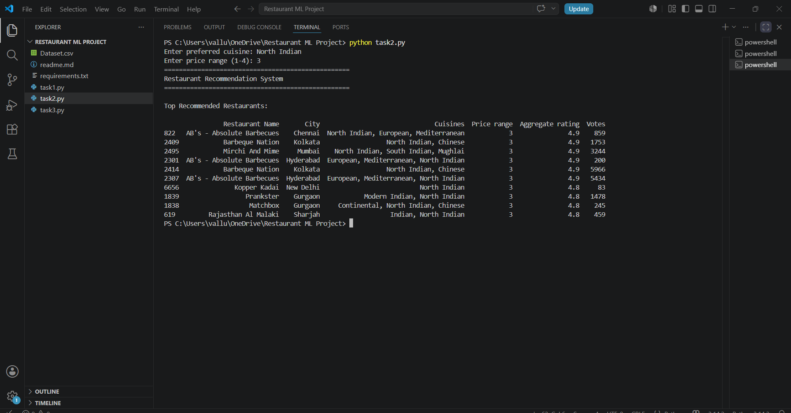
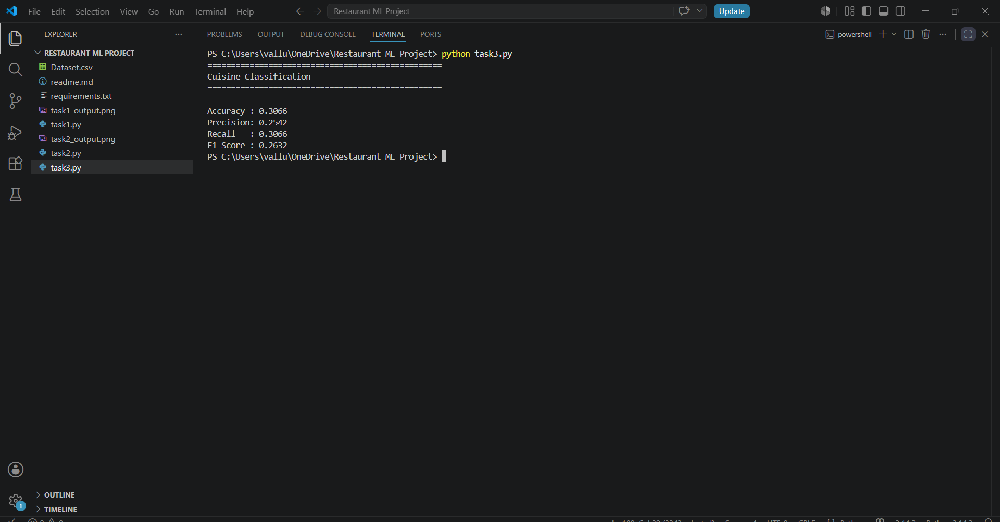

# 🍽️ Restaurant Machine Learning Project

A Machine Learning project built using **Python** and **Scikit-learn** to solve three real-world restaurant analytics tasks:

- ⭐ Restaurant Rating Prediction
- 🍴 Restaurant Recommendation System
- 🍜 Cuisine Classification

This project was completed as part of the **Cognifyz Technologies Machine Learning Internship**.

---

# 📌 Project Overview

This repository contains three independent machine learning tasks using the Zomato Restaurant Dataset.

The project demonstrates the complete machine learning workflow, including:

- Data preprocessing
- Handling missing values
- Encoding categorical features
- Model training
- Model evaluation
- Content-based recommendation

---

# 📂 Project Structure

```
Restaurant-ML-Project/
│
├── Dataset.csv
├── task1.py
├── task2.py
├── task3.py
├── requirements.txt
├── .gitignore
├── LICENSE
├── CONTRIBUTING.md
├── README.md
├── task1_output.png
├── task2_output.png
└── task3_output.png
```

---

# 🚀 Technologies Used

- Python
- Pandas
- NumPy
- Scikit-learn
- Matplotlib
- VS Code

---

# 📊 Task 1 – Restaurant Rating Prediction

### Objective

Predict the **Aggregate Rating** of restaurants using machine learning.

### Workflow

- Loaded and preprocessed the dataset
- Filled missing values
- Removed unnecessary features
- Encoded categorical variables
- Split the dataset into training and testing sets
- Trained a Decision Tree Regressor
- Evaluated the model using Mean Squared Error (MSE) and R² Score
- Identified the most influential features

### Results

- Mean Squared Error (MSE): **0.1549**
- R² Score: **0.9319**

---

# 🍽️ Task 2 – Restaurant Recommendation System

### Objective

Recommend restaurants based on user preferences.

### Recommendation Criteria

- Cuisine
- Price Range

### Workflow

- Handled missing cuisine values
- Filtered restaurants based on user input
- Ranked restaurants by Aggregate Rating
- Displayed the top recommendations

---

# 🍜 Task 3 – Cuisine Classification

### Objective

Classify restaurants based on their cuisines.

### Workflow

- Filled missing values
- Selected the primary cuisine
- Encoded cuisine labels
- Trained a Random Forest Classifier
- Evaluated the model using:
  - Accuracy
  - Precision
  - Recall
  - F1 Score

### Results

- Accuracy: **0.3066**
- Precision: **0.2542**
- Recall: **0.3066**
- F1 Score: **0.2632**

---

# 📸 Project Outputs

## Task 1



---

## Task 2



---

## Task 3



---

# ⚙️ Installation

Clone the repository:

```bash
git clone https://github.com/srivarshatech/Restaurant-ML-Project.git
```

Move into the project folder:

```bash
cd Restaurant-ML-Project
```

Install the required libraries:

```bash
pip install -r requirements.txt
```

---

# ▶️ Run the Project

Task 1

```bash
python task1.py
```

Task 2

```bash
python task2.py
```

Task 3

```bash
python task3.py
```

---

# 📚 Learning Outcomes

Through this project, I learned:

- Data preprocessing using Pandas
- Handling missing values
- Feature encoding
- Regression using Decision Trees
- Classification using Random Forest
- Building a content-based recommendation system
- Model evaluation using Scikit-learn
- Organizing and documenting a machine learning project with GitHub

---

# 🔮 Future Improvements

- Improve cuisine classification accuracy using hyperparameter tuning
- Experiment with additional machine learning models
- Build a web interface using Streamlit
- Deploy the project online

---

# 👩‍💻 Author

**Sri Varsha Valluripalli**

B.Tech Computer Science Engineering (AI & ML)

GitHub: https://github.com/srivarshatech

---

If you found this project useful, consider giving it a ⭐.
